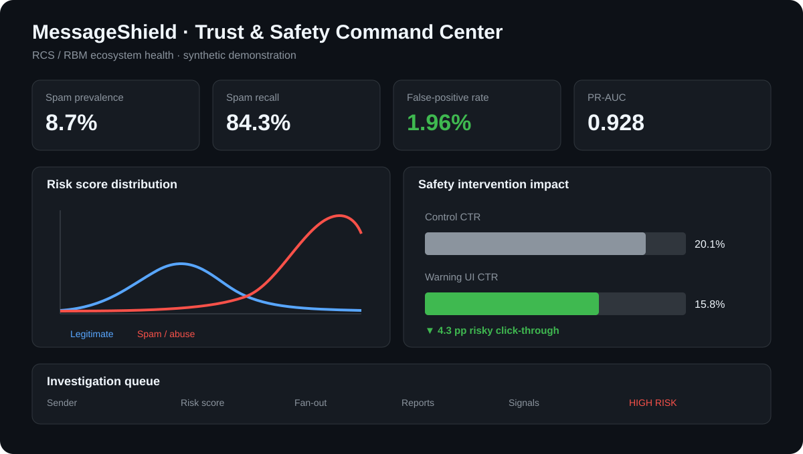

<div align="center">

# 🛡️ MessageShield

### RCS / RBM Trust & Safety Data Science Platform

**Spam · Phishing · Abuse Detection · AI Intelligence · Graph Analytics · A/B Testing · Counterfactual Inference · Policy Decisioning · Ecosystem Monitoring**

[](https://www.python.org/)
[](https://streamlit.io/)
[](https://scikit-learn.org/)
[](https://networkx.org/)
[](#)

**message → AI label → sender behavior → graph context → risk score → policy action → experiment → monitoring**

</div>

---

## 📊 Dashboard preview

<p align="center">
  
</p>

> **Command Center:** executive ecosystem health, model effectiveness, false-positive guardrails, intervention impact, and a high-risk investigation queue. The product now also includes dedicated views for **AI abuse intelligence, global abuse intelligence, coordinated campaign detection, and Trust & Safety policy decisioning**.

---

## Product concept

MessageShield is a portfolio-grade Trust & Safety data science system for protecting an **RCS/RBM-style messaging ecosystem** from spam, phishing, scams, impersonation, and unwanted traffic while minimizing harm to legitimate users.

Rather than treating abuse detection as a pure classification task, the project combines **NLP, AI-assisted abuse taxonomy, sender behavior, graph topology, experimentation, counterfactual inference, proportional policy actions, and operational monitoring** into one product-oriented workflow.

> **Privacy / provenance:** all data is synthetic. This project is inspired by common large-scale messaging Trust & Safety problems and is not affiliated with, trained on, or derived from Google production systems.

---

## What a reviewer can see in 60 seconds

| Surface | What it demonstrates |
|---|---|
| **Trust & Safety Command Center** | Executive ecosystem KPIs, spam score distribution, intervention impact, high-risk investigation queue |
| **Model Performance** | ROC-AUC, PR-AUC, threshold sensitivity, false-positive guardrail, precision-recall trade-offs |
| **Abuse Network** | Sender fan-out, campaign-like behavior, repeated text, reports, URLs, high-risk sender ranking |
| **Experiments & Counterfactuals** | A/B testing, two-proportion z-test, IPW counterfactual estimate, treatment side effects |
| **Ecosystem Monitoring** | Trend monitoring, prevalence, enforcement, recall, false positives, click-through, anomaly alerts |
| **AI Abuse Intelligence** | Explainable labels for phishing/scam/impersonation/malware/spam with confidence and evidence |
| **Global Abuse Intelligence** | Market-tier and P2P-vs-RBM risk segmentation, emerging abuse vectors, operating tables |
| **Campaign Graph** | Coordinated-abuse candidates, sender fan-out, graph components, campaign-risk ranking |
| **Policy Decision Simulator** | Allow / review / rate-limit / warn / quarantine / block decision ladder |

---

## System architecture

```text
Synthetic RCS / RBM events
          │
          ├───────────────┬────────────────┬────────────────┐
          ▼               ▼                ▼                ▼
      Text / NLP       Behavior        Graph topology    AI taxonomy
      TF-IDF           velocity        fan-out           abuse label
      n-grams           reports         PageRank          confidence
          └───────────────┴────────────────┴────────────────┘
                                  │
                                  ▼
                           Spam risk model
                                  │
                    ┌─────────────┼──────────────┐
                    ▼             ▼              ▼
               Policy action  Experimentation  Monitoring
               allow → block     A/B + IPW     ecosystem health
```

---

## Detection strategy

The classifier fuses three core signal families:

| Signal family | Examples |
|---|---|
| **Text** | TF-IDF word/bi-gram patterns, spam language, repeated phrasing |
| **Behavioral** | 24h sending velocity, unique recipients, URLs, reports, sender age |
| **Graph** | sender out-degree, weighted fan-out, PageRank, fan-out ratio |

The operating threshold is chosen to **maximize spam recall while keeping false-positive rate ≤ 2%**. This reflects the Trust & Safety cost of blocking legitimate conversations.

On top of the classifier, `src/abuse_intelligence.py` adds an explainable abuse taxonomy and `src/enforcement.py` maps risk into a proportional product action.

---

## New intelligence + policy layers

### 🤖 AI Abuse Intelligence

Messages receive an explainable abuse class such as **phishing, scam, impersonation, malware, spam, or benign**, plus a confidence score and short evidence string. The current implementation is deterministic and local so the repository remains reproducible; it is designed as the interface where a production embedding/LLM classifier could be evaluated and substituted.

### 🌍 Global Abuse Intelligence

The dashboard segments synthetic traffic by **market-risk tier** and **P2P vs RBM**, then compares spam prevalence, model score, reports, click behavior, and emerging vectors. This demonstrates how a global communications product could prioritize regional enforcement and measurement.

### 🕸️ Coordinated Campaign Detection

Sender-level aggregation ranks potential campaigns using **recipient fan-out, repeated behavior, reports, URLs, spam prevalence, and model score**. A graph summary exposes connectivity and component structure, with a production path toward shared-URL/domain/business-ID community detection.

### 🎯 Trust & Safety Policy Decisioning

Model risk is translated into a proportional action ladder:

`ALLOW → HUMAN REVIEW → RATE LIMIT → WARN → QUARANTINE → BLOCK`

The simulator makes the distinction between **prediction** and **product policy** explicit—an important part of real Trust & Safety systems.

---

## Multi-page dashboards

1. `dashboard/app.py` — 🛡️ **Trust & Safety Command Center**
2. `dashboard/pages/1_Model_Performance.py` — 📈 **Model Performance**
3. `dashboard/pages/2_Abuse_Network.py` — 🕸️ **Abuse Network & Sender Behavior**
4. `dashboard/pages/3_Experiments_Counterfactuals.py` — 🧪 **Experiments & Counterfactuals**
5. `dashboard/pages/4_Ecosystem_Monitoring.py` — 🌐 **Ecosystem Health & Monitoring**
6. `dashboard/pages/5_AI_Abuse_Intelligence.py` — 🤖 **AI Abuse Intelligence**
7. `dashboard/pages/6_Global_Abuse_Intelligence.py` — 🌍 **Global Abuse Intelligence**
8. `dashboard/pages/7_Campaign_Graph.py` — 🕸️ **Coordinated Campaign Detection**
9. `dashboard/pages/8_Policy_Decision_Simulator.py` — 🎯 **Policy Decision Simulator**

---

## Trust & Safety measurement framework

| Dimension | Core question | Example metric |
|---|---|---|
| **Prevalence** | How much abuse reaches the ecosystem? | spam prevalence |
| **Coverage** | How much abuse do we catch? | recall |
| **Collateral damage** | How often do we block legitimate traffic? | FPR |
| **Decision quality** | Are positive decisions reliable? | precision / PR-AUC |
| **AI quality** | Are abuse labels confident and explainable? | label confidence / taxonomy mix |
| **Campaign risk** | Is abuse coordinated across senders? | fan-out / graph components / campaign risk |
| **User impact** | Does an intervention reduce risky behavior? | CTR change |
| **Causal impact** | What would happen without treatment? | IPW ATE |
| **Policy mix** | Are interventions proportional to risk? | allow/warn/quarantine/block distribution |
| **Adversarial change** | Is traffic behavior shifting? | score / metric alerts |

---

## Repository map

```text
MessageShield-RCS-Trust-Safety/
├── assets/
│   └── dashboard-preview.svg
├── dashboard/
│   ├── app.py
│   └── pages/
│       ├── 1_Model_Performance.py
│       ├── 2_Abuse_Network.py
│       ├── 3_Experiments_Counterfactuals.py
│       ├── 4_Ecosystem_Monitoring.py
│       ├── 5_AI_Abuse_Intelligence.py
│       ├── 6_Global_Abuse_Intelligence.py
│       ├── 7_Campaign_Graph.py
│       └── 8_Policy_Decision_Simulator.py
├── src/
│   ├── generate_data.py
│   ├── features.py
│   ├── model.py
│   ├── abuse_intelligence.py
│   ├── enforcement.py
│   ├── experiments.py
│   ├── monitoring.py
│   └── run_pipeline.py
├── tests/
│   └── test_pipeline.py
├── requirements.txt
└── README.md
```

---

## Run locally

```bash
python -m venv .venv
source .venv/bin/activate
pip install -r requirements.txt
python src/run_pipeline.py --rows 30000
streamlit run dashboard/app.py
```

---

## Why this project is relevant to messaging Trust & Safety

| Role capability | Repository evidence |
|---|---|
| Large-scale abuse analytics | synthetic event pipeline + ecosystem KPIs |
| Spam / phishing classification | NLP + behavioral + graph classifier |
| AI tools in data science | explainable abuse intelligence layer + confidence/evidence interface |
| Adversarial behavior analysis | velocity, repetition, fan-out, reports, URLs |
| Coordinated-abuse analysis | campaign-risk ranking + graph connectivity |
| A/B testing | warning-UI experiment + z-test |
| Counterfactual analysis | inverse propensity weighting |
| False-positive management | explicit ≤2% FPR threshold guardrail |
| Product policy | proportional intervention ladder |
| Global ecosystem measurement | market-tier + P2P/RBM segmentation |
| Automated monitoring | trend dashboards + anomaly heuristics |
| Cross-functional communication | executive, analyst, experiment, and policy surfaces |

---

## Production evolution

A real deployment could replace the deterministic AI taxonomy with **multilingual embeddings or a frontier/open-weight classifier**, add shared URL/domain/business identity graph entities, streaming features, regional calibration, human-review feedback, appeal outcomes, policy versioning, challenger models, and privacy-preserving aggregation.

---

<div align="center">

### Protect ecosystem trust without sacrificing legitimate communication.

**NLP · AI Classification · Graph ML · Behavioral Analytics · Experimentation · Causal Inference · Policy Decisioning · Monitoring**

</div>
